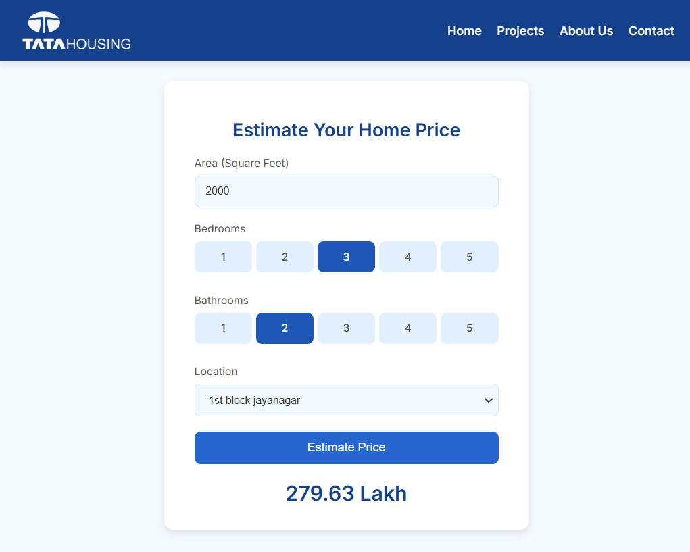

# House Price Predictions Website on AWS



This data science project series walks through step by step process of how to build a real estate price prediction website. We will first build a model using sklearn and linear regression using banglore home prices dataset from kaggle.com. Second step would be to write a python flask server that uses the saved model to serve http requests. Third component is the website built in html, css and javascript that allows user to enter home square ft area, bedrooms etc and it will call python flask server to retrieve the predicted price. During model building we will cover almost all data science concepts such as data load and cleaning, outlier detection and removal, feature engineering, dimensionality reduction, gridsearchcv for hyperparameter tunning, k fold cross validation etc. Technology and tools wise this project covers,

1. Python
2. Numpy and Pandas for data cleaning
3. Matplotlib for data visualization
4. Sklearn for model building
5. Jupyter notebook, visual studio code and pycharm as IDE
6. Python flask for http server
7. HTML/CSS/Javascript for UI


# Deployment to Cloud (AWS EC2)

Follow these quick steps to deploy the Real Estate Price Prediction website on AWS:

1. **Launch an EC2 Instance:**  
   - Set up an instance on AWS and allow HTTP traffic in the security group.

2. **Set Up Server Environment:**  
   - Install nginx and Python packages:  
     ```bash
     sudo apt-get update
     sudo apt-get install nginx python3-pip
     sudo pip3 install -r /path-to-your-project/server/requirements.txt
     ```

3. **Upload Project Files:**  
   - Use tools like `scp` or `WinSCP` to transfer your project files to the EC2 instance.

4. **Start the Flask App:**  
   - Run the server:  
     ```bash
     python3 /path-to-your-project/server.py
     ```

5. **Visit the Website:**  
   - Access your site using the public URL of the EC2 instance.
   - Here is the website link : [Real Estate Price Prediction Website](http://ec2-52-65-223-207.ap-southeast-2.compute.amazonaws.com/) 

